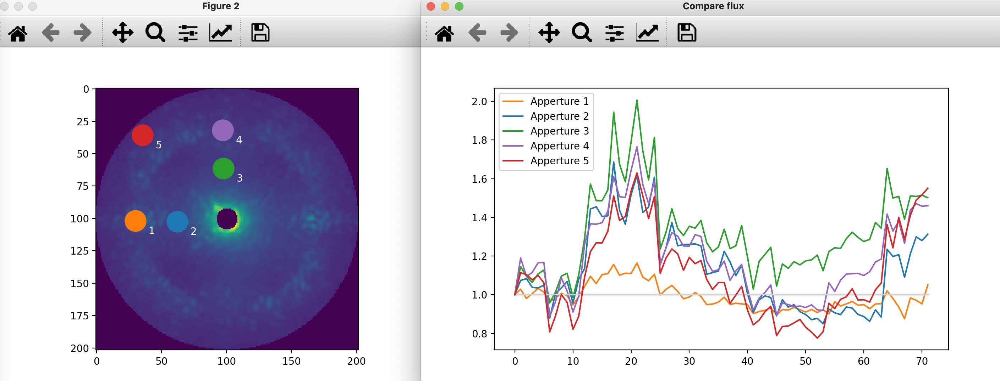

# App_flx_var

A small tool to visualize the variation of flux in different apertures within 3D image cubes

1 - Set the path of the cube and the few parameters (nb_app, crop size, app_size). 3D cube as fits file with dimension in order (nb_frame,frame_width, frame height).
2 - Run the script
3 - Click on the image with your mouse to position the aperture(s) 
4 - Example of plot produced below &darr

